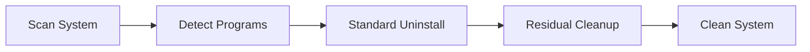

# uninstaller-pro-manager-suite 🧹🔥

  

*The uninstaller that actually finishes the job — because "Add/Remove Programs" is where good intentions go to die.*

  

---

## 👋 Overview

Let's get something off my chest: Windows' native uninstaller is a museum exhibit. It's been "good enough" since Vista, and every year we just... accept it. Meanwhile your registry fills up with orphaned keys, your `Program Files` folder becomes an archaeological dig site, and that toolbar you installed once in 2019 is somehow still phoning home. **uninstaller-pro-manager-suite** exists because someone had to say "enough" — this is a curated landing point and management suite built around the workflow people actually search for when they type *IObit Uninstaller Pro full version download*: a real, deep-clean uninstaller that doesn't quit after the surface-level removal.

This isn't a wrapper script or a registry-cleaner gimmick. It's a suite concept — documentation, workflow tooling, and a landing page — organized around getting you to a legitimate, current, full-featured build of IObit Uninstaller Pro for Windows 10/11, with the bloatware-scanning, forced-uninstall, and residual-file-hunting capabilities that made the tool popular in the first place. It's for power users who reinstall Windows twice a year, IT folks cleaning up client machines, and anyone who's ever screamed at a "this program cannot be uninstalled because it's currently running" dialog.

Who's this for? If you've ever manually deleted a `.exe`, called it a day, and then found 400MB of leftovers six months later — hi, this repo is your intervention. We took the chaos of "which download link is even real" and turned it into one clean project page.

## 🚀 Get It Running In 3 Steps

> [!TIP]
> Skip the wall of text below if you just want the thing. Here's the express lane.

1. **Click the download button** below — it routes to the official project landing page, not a random mirror.
2. **Run the installer** and let it do its standard Windows install dance (next, next, finish — revolutionary, I know).
3. **Launch, scan, obliterate.** Point it at your bloatware, plugins, or that one app that refuses to die, and let the deep-scan engine do the rest.

---

## 🧠 What Makes This Different (Not Just Another Delete Button)

  

- **Forced Uninstall Mode** — when Windows says "this program is stuck," this is the crowbar. It tears through orphaned registry entries and half-installed remnants that normal uninstallers politely leave behind.

- **Bulk Batch Removal** — select twenty programs, hit go, walk away. No more clicking "uninstall → next → finish" in a loop like it's 2004.

- **Residual Leftover Hunter** — post-uninstall scanning that digs through `AppData`, registry hives, and temp folders for the crumbs regular uninstallers never sweep up.

- **Bloatware & Plugin Radar** — flags pre-installed manufacturer junk and browser toolbars/plugins that snuck in during other installs. Great for freshly unboxed laptops.

- **Startup & Software Health Monitor** — surfaces what's silently loading at boot and what's quietly eating disk space, so cleanup becomes proactive instead of reactive.

- **Large File & Duplicate Sweep** — an optional companion pass for finding disk hogs that have nothing to do with installed apps but are just... sitting there. Judging you.

- **Update Radar** — cross-references installed software against known current versions so you're not running five-year-old drivers without realizing it.

- **Full Version Feature Set** — the paid-tier capabilities (forced removal, batch actions, deeper scan depth) are what separate a "good enough" uninstall from an actually clean system.

> [!NOTE]
> "Full version" here refers to the complete, unrestricted feature set of the application itself — not a modified build. Always get it through the official landing page linked in this repo.

---

## ⚙️ System Requirements

| Component | Minimum | Recommended |
|---|---|---|
| OS | Windows 10 (64-bit) | Windows 11 (latest build) |
| RAM | 2 GB | 4 GB+ |
| Disk Space | 200 MB free | 500 MB free |
| Dependencies | None — standalone | None — standalone |
| Admin Rights | Required for forced uninstall | Required |
| .NET / Runtime | Not required | Not required |

> [!IMPORTANT]
> This is a standalone Windows desktop application. There are no external runtimes, no background services, and nothing to `pip install`. If a "download" claims you need extra components first, that's a red flag, not a feature.

---

## 🏗️ How It Works

The mental model is simple — think of it as a four-stage pipeline that runs every time you point it at a target application:

1. **Discovery** — the app enumerates installed programs via registry + filesystem cross-reference.
2. **Standard Removal** — it invokes the program's own uninstaller first (the polite handshake).
3. **Residual Scan** — it then independently scans for anything the vendor's uninstaller left behind.
4. **Forced Cleanup** — if the standard route fails or stalls, forced-mode steps in to finish the job.
5. **Report** — you get a clean summary of what was found, removed, and what's now safely gone.

---

## 🩹 Troubleshooting

<strong>Q: The program says "cannot be uninstalled" — now what?</strong>

Switch to Forced Uninstall Mode. It bypasses a stalled vendor uninstaller and removes the program's files, shortcuts, and registry entries directly. This is the exact scenario the mode exists for.

<strong>Q: I removed an app but its folder is still in Program Files.</strong>

Run a Residual Scan after removal — sometimes vendor uninstallers exit before finishing filesystem cleanup, especially if the app was mid-update.

<strong>Q: Antivirus flagged the installer during download.</strong>

Deep-scanning uninstaller tools touch the registry heavily, which occasionally trips heuristic AV engines. Always download from the official landing page linked in this README, verify the publisher signature, and whitelist only after confirming the source.

<strong>Q: Batch uninstall skipped one program in the list.</strong>

That app likely has a running process locking its files. Close it manually or reboot into the built-in "Uninstall on next boot" queue and try the batch again.

<strong>Q: Does this work on Windows 11 24H2 / later builds?</strong>

Yes — the suite tracks current Windows 10/11 builds since it operates against standard registry and filesystem APIs rather than version-specific hacks (the good kind of "hack" we're not allowed to call a hack).

> [!WARNING]
> Forced Uninstall Mode is powerful — double-check you selected the right program before confirming. There's no undo button for "oops, deleted my VPN client."

---

## 🎛️ UI, UX & Keyboard Shortcuts

The interface leans toward "dashboard," not "wizard" — everything's a list, a filter, and an action button. Dark and light themes are both available, plus a compact list-density option for people managing 100+ installed apps.

| Shortcut | Action |
|---|---|
| `Ctrl + F` | Focus search / filter box |
| `Ctrl + A` | Select all listed programs |
| `Delete` | Queue selected program(s) for uninstall |
| `Ctrl + Shift + F` | Trigger Forced Uninstall on selection |
| `F5` | Refresh installed program list |
| `Ctrl + B` | Open Bulk/Batch uninstall panel |
| `Ctrl + R` | Run Residual Leftover Scan |
| `Ctrl + ,` | Open Settings |
| `Ctrl + T` | Toggle Dark / Light theme |
| `Esc` | Cancel current scan or dialog |

> [!TIP]
> Sort by "Install Date" before a cleanup session — it's the fastest way to spot the toolbar you installed by accident three years ago.

---

## 🤝 Contributing & Community

This repo thrives on people who are just as annoyed at digital clutter as we are.

- Open an issue for docs corrections, landing-page bugs, or workflow suggestions.
- Submit a PR if you've improved the troubleshooting guide or found a sharper way to explain a feature.
- Discussions are open for workflow tips — share your favorite forced-uninstall war story.

> [!NOTE]
> This repository focuses on documentation, landing-page delivery, and workflow guidance around the tool — not on redistributing modified binaries. Keep contributions aligned with that scope.

---

## 📜 License

Released under the [MIT License](LICENSE), 2026.

## ⚠️ Disclaimer

This project is an independent, community-maintained landing page and documentation suite. It is not officially affiliated with, endorsed by, or representing IObit in any official capacity. All trademarks belong to their respective owners. Always download software from official or verified sources, and review permissions before granting administrative access to any uninstaller tool.

